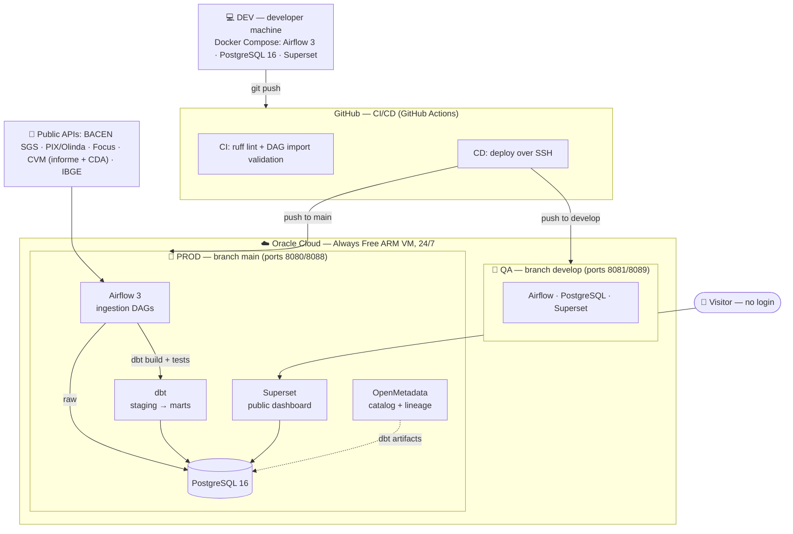
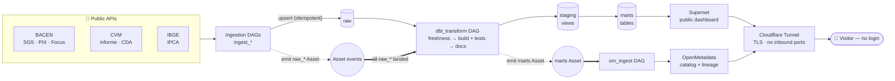

# Brazil Economy Observatory

[](https://github.com/geraldoschuetze/brazil-economy-observatory-public/actions/workflows/ci.yml)
[](LICENSE)


> 🇧🇷 [Versão em português](README.pt-BR.md)

**Brazilian Financial Market Observatory** — an end-to-end ELT pipeline running 24/7 on a cloud VM, ingesting public data from the Brazilian Central Bank (BACEN), the Securities Commission (CVM) and IBGE into a dimensional PostgreSQL warehouse, transformed and **tested with dbt**, served by a public Apache Superset dashboard and catalogued in OpenMetadata.

**Stack:** Apache Airflow 3 · **dbt** · PostgreSQL 16 · Apache Superset · OpenMetadata · Docker Compose · Oracle Cloud (ARM) · GitHub Actions

### What this demonstrates

A production-grade data platform, built and operated end to end:

- **Dimensional modeling & dbt** — layered `raw → staging → marts`, star-schema facts, 51 data-quality tests and per-source freshness SLAs.
- **Event-driven orchestration** — Airflow 3 with data-aware scheduling (Assets); idempotent, incremental ingestion.
- **Data governance & lineage** — OpenMetadata catalog with column-level lineage, glossary and data-product ownership.
- **Automated delivery** — DEV → QA → PROD promotion via GitHub Actions; one reproducible Docker Compose per environment.
- **Security-first ops** — no inbound ports (Cloudflare Tunnel), read-only public surfaces, generated secrets, spec-driven workflow under a project constitution.

> 🔴 **Live**: the production pipeline runs 24/7 on an Oracle Cloud Always Free ARM VM.
> **[Open the public dashboard](https://economy.geraldoschuetze.com/superset/dashboard/visao-geral/)** — no login needed.
> Warehouse holds **millions of rows** across BACEN (SGS, PIX, Focus), CVM (daily fund reports + CDA portfolios) and IBGE sources.

[](https://economy.geraldoschuetze.com/superset/dashboard/visao-geral/)

## Live access (read-only)

Two public surfaces, served over HTTPS — no setup required:

| Surface | URL | Access |
|---|---|---|
| **Dashboard** (Superset) | https://economy.geraldoschuetze.com/superset/dashboard/visao-geral/ | open — no login |
| **Data catalog** (OpenMetadata) | https://economy-catalog.geraldoschuetze.com | read-only viewer (below) |

OpenMetadata read-only viewer login:

- **User:** `guest@economy.observatory`
- **Password:** `Economy@2026!`

> The viewer is **read-only**: browsing, column-level lineage and the glossary only —
> every write path and sign-up is blocked at the nginx proxy.

## Architecture — three environments, fully automated promotion



| Environment | Runs on | Branch | Deploy |
|---|---|---|---|
| **DEV** | developer machine | feature/local | `make up` |
| **QA** | Oracle Cloud VM | `develop` | **automatic** on push (GitHub Actions) |
| **PROD** | Oracle Cloud VM | `main` | **automatic** on merge (GitHub Actions) |

Every change follows the same path — DAGs, SQL models and even Superset
dashboards (declared in `superset/bootstrap_dashboard.py`): test locally,
push to `develop`, validate on QA, merge to `main`.

## End-to-end data flow

The runtime pipeline is **event-driven**: nothing runs on a guessed clock. Each
ingestion DAG emits an Airflow **Asset** when its `raw` data lands; `dbt_transform`
waits on *all* of them, and its `marts` Asset in turn triggers `om_ingest`.



A failing dbt test stops the bad data at `dbt build`, before it can reach `marts`
or the charts. Both public surfaces (Superset, OpenMetadata) are read-only and
reached only through the outbound Cloudflare Tunnel.

## Data model & transformation (dbt)

The warehouse follows a layered dimensional design. **Airflow owns ingestion**
(landing immutable data in `raw`); **dbt owns everything downstream** —
`staging` and `marts` are dbt models, so dependencies are resolved from
`ref()`/`source()` instead of hand-ordered SQL:

| Schema | Owner | Purpose |
|---|---|---|
| `raw` | Airflow DAGs | Data as delivered by the source APIs — immutable, reload-safe |
| `staging` | dbt (views) | Typed, conformed (date / series keys, digits-only CNPJ) |
| `marts` | dbt (tables) | Star-schema facts + derived indicators (e.g. real rate = Selic − IPCA) |

Ingestion is **incremental and idempotent**: each daily run upserts only the new
observations; re-running any day produces the same result.

### Data quality & testing

- **dbt tests** (51 assertions): `not_null`/`unique` keys, plus project-local
  generic tests (`non_negative`, `in_range`) on metrics. `dbt build` runs each
  model *and its tests* in dependency order — a failing test **stops bad data
  from propagating** to the charts.
- **Source freshness**: `dbt source freshness` flags any upstream API that
  stopped publishing, per-source SLAs (daily / weekly / monthly).
- **Unit tests** (`pytest`): the pure ingestion logic (month math, CVM row
  normalization, idempotent backfill) lives in `include/brazil_economy` and is tested in
  isolation — no Airflow, no network.
- **Failure alerting**: every DAG posts to a webhook (`BRAZIL_ECONOMY_ALERT_WEBHOOK`,
  Slack-compatible) on failure, degrading to a log line when none is set.
- **Consolidated fund PL** (accuracy): the daily CVM informe sums every fund
  class, double-counting the slice a fund-of-funds holds in cotas of other
  funds. The **`ingest_cvm_cda`** DAG loads the CVM **CDA** portfolios (block
  "Cotas de Fundos") and the `fct_fundos_pl_consolidado_mensal` mart subtracts
  exactly those cross-holdings, so the industry PL reads **~R$10–11 tri
  (ANBIMA-comparable)** instead of the ~R$13 tri gross sum.

Transformation runs as the **`dbt_transform` DAG**, triggered **data-aware**: each
ingestion DAG marks an Airflow **Asset** when its raw data lands, and
`dbt_transform` is scheduled on *all* of them — so it rebuilds the moment the day's
sources have landed, not on a guessed clock. It runs `source freshness` →
`dbt build` (models + tests) → `dbt docs generate` (the lineage artifacts
OpenMetadata ingests), then emits a `marts` Asset that triggers `om_ingest`.

### Catalog & lineage (OpenMetadata)

An **opt-in** OpenMetadata stack catalogs every table and dashboard and rebuilds
**column-level lineage** — `raw → staging → marts → Superset` — automatically
from the dbt artifacts, plus a glossary, tags and data-product governance. It is
exposed through a **read-only** nginx proxy (browsing + a shared viewer login;
all writes/signup blocked), and kept current by the **`om_ingest` DAG**. See
[docs/openmetadata.md](docs/openmetadata.md).

[](https://economy-catalog.geraldoschuetze.com)

*Column-level lineage rebuilt automatically from dbt artifacts — `stg_cvm_cda_*` → `fct_fundos_pl_consolidado_mensal` → the public dashboard. Browse it live at [economy-catalog.geraldoschuetze.com](https://economy-catalog.geraldoschuetze.com).*

## Running it

Requirements: Docker Engine with the compose plugin.

```bash
make env   # generates .env with random secrets (never committed)
make up    # starts Postgres + Airflow + Superset (dbt ships inside the Airflow image)
```

- Airflow UI → http://localhost:8080
- Superset → http://localhost:8088

The same compose file powers both the local dev environment and the production VM — only `.env` differs.

Developer checks (what CI runs):

```bash
pytest -q                      # unit tests + doctests for the pure helpers
ruff check . && ruff format --check .
cd dbt && dbt parse            # validate models, refs, sources and tests
```

## Development workflow — spec-driven

Changes are governed by a project **constitution**
([`.specify/memory/constitution.md`](.specify/memory/constitution.md), v1.0.0) and
built with [GitHub Spec Kit](https://github.com/github/spec-kit):

```text
/speckit-specify    → what & why (the spec — no implementation detail)
/speckit-clarify    → de-risk ambiguities (optional)
/speckit-plan       → the how (technical plan; checked against the constitution)
/speckit-tasks      → dependency-ordered, actionable tasks
/speckit-implement  → execute
```

The constitution encodes the non-negotiables — **Security First**, **Data Quality as
a release gate**, **public-data-only** — so every plan is validated against them
before any code is written. Promotion stays DEV → QA (`develop`) → PROD (`main`),
automated by GitHub Actions. To pause/resume the local stack between sessions, see
[docs/runbook-stack-onoff.md](docs/runbook-stack-onoff.md).

## Roadmap

- [x] Project scaffolding (compose, warehouse bootstrap, secrets handling)
- [x] `ingest_sgs` DAG — macro indicators (Selic, IPCA, FX) with 2020+ backfill
- [x] `ingest_pix` · `ingest_focus` · `ingest_cvm_funds` · `ingest_ipca_aberturas` DAGs
- [x] Public "Pulso da Economia Brasileira" Superset dashboard (dashboard-as-code, ~29 charts + choropleth map)
- [x] CI (ruff + DAG validation + pytest + dbt parse) and CD (push → VM) via GitHub Actions
- [x] Production deploy on Oracle Cloud ARM VM, running 24/7
- [x] **dbt transformation layer** — staging + marts as models, 51 data-quality tests, source freshness
- [x] **Unit tests + failure alerting** for the ingestion DAGs
- [x] **Native dashboard filters** (period + region) and **OpenMetadata** catalog/lineage
- [x] **Consolidated fund PL** via CVM **CDA** netting — removes fund-of-funds double counting
- [x] **`om_ingest` DAG** + read-only public catalog — automates the OpenMetadata refresh (native pipelines triggered after `dbt_transform`), CI/CD-driven on QA and PROD
- [x] **Custom domain + HTTPS via Cloudflare Tunnel** — Superset + OpenMetadata served over TLS at `*.geraldoschuetze.com`; the VM keeps no inbound web ports open
- [ ] New sources (BNDES, foreign trade/Comex, ANP) and dbt snapshots for slowly-changing dimensions

### Known limitations & optional follow-ups

- **Consolidated PL is monthly** — the CDA portfolio is published monthly, so the
  industry-PL line is month-end; it lands ~R$10–11 tri (ANBIMA-comparable), with
  any small residual vs ANBIMA owing to perimeter differences.
- **Public endpoint** is served over HTTPS on `*.geraldoschuetze.com` through a
  Cloudflare Tunnel — `cloudflared` dials out only, so the VM exposes no inbound
  web ports (see [docs/cloudflare-tunnel.md](docs/cloudflare-tunnel.md)).
- **OpenMetadata** is automated end-to-end: the `om_ingest` DAG refreshes the
  catalog daily and the deploy wires the native pipelines + bot token. JWT signing
  keys are generated per-environment on the VM (`scripts/om_gen_jwt_keys.sh`,
  gitignored) — the bundled demo keys are no longer used.

## Design decisions

- **Airflow ingests, dbt transforms** — a clean handoff: DAGs land immutable
  `raw`, dbt builds and *tests* `staging`/`marts` with auto-resolved lineage.
- **Data-aware scheduling (Airflow Assets)** — each ingestion DAG publishes a
  `raw_*` Asset on success; `dbt_transform` is scheduled on *all* of them and emits
  `marts`, which triggers `om_ingest`. The pipeline advances when the data is
  ready, not on a guessed clock — and the dependency graph is visible in Airflow's
  Assets view (`dags/brazil_economy_assets.py`).
- **dbt over hand-ordered SQL** — `ref()` removes the manual mart ordering, and
  pairs with OpenMetadata to produce column-level lineage for free.
- **dbt in an isolated venv** inside the Airflow image — no dependency clash with
  Airflow's pinned constraints.
- **LocalExecutor, not Celery/Kubernetes** — single-VM deployment; the simplest executor that fits the workload is the right one.
- **One Postgres, three databases** — `airflow` and `superset` metadata live alongside the `brazil_economy` warehouse to keep the footprint inside a free-tier VM.
- **Secrets via generated `.env`** — `make env` creates random credentials per environment; nothing sensitive is ever committed.
- **Public data only** — every byte ingested comes from open government APIs.

## License

[MIT](LICENSE) © Geraldo Schuetze Junior

---

**Built by Geraldo Schuetze Junior** — Data Engineer & Data Analyst
[LinkedIn](https://www.linkedin.com/in/geraldoschuetze/) · Live demo → [economy.geraldoschuetze.com](https://economy.geraldoschuetze.com/superset/dashboard/visao-geral/)
