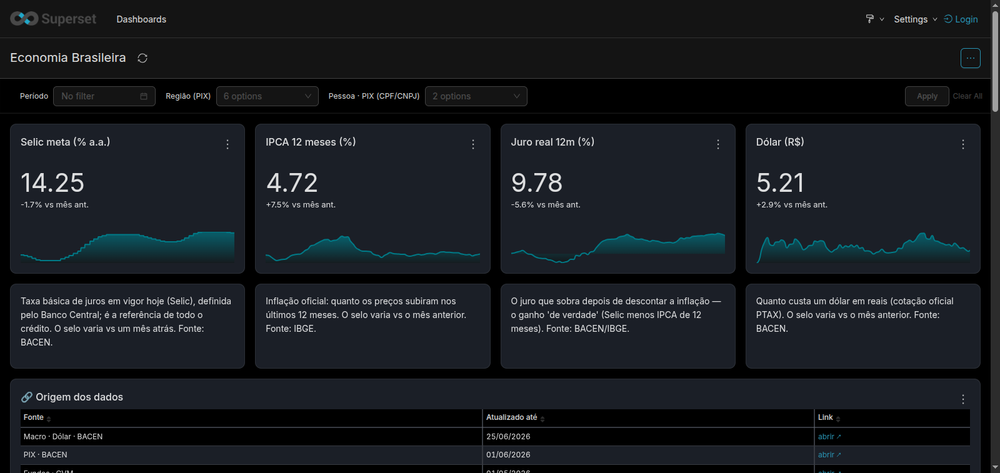
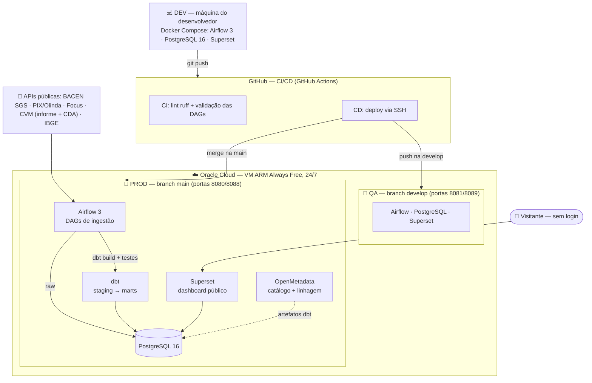
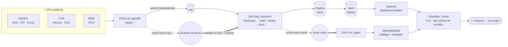
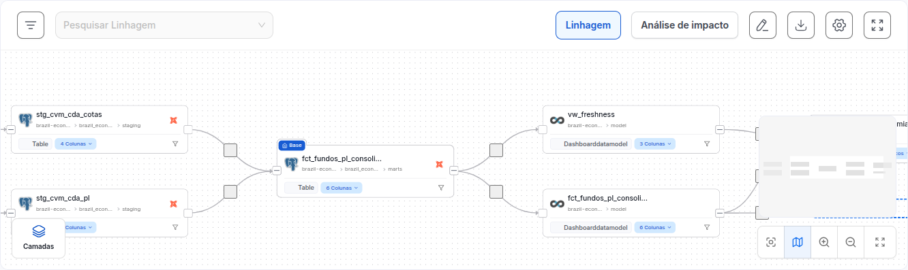

# Brazil Economy Observatory

[](https://github.com/geraldoschuetze/brazil-economy-observatory-public/actions/workflows/ci.yml)
[](LICENSE)


> 🇺🇸 [English version](README.md)

**Observatório do Mercado Financeiro Brasileiro** — pipeline ELT de ponta a ponta rodando 24/7 numa VM em nuvem, ingerindo dados públicos do Banco Central (BACEN), da CVM e do IBGE para um warehouse dimensional em PostgreSQL, transformados e **testados com dbt**, servidos por um dashboard público em Apache Superset e catalogados no OpenMetadata.

**Stack:** Apache Airflow 3 · **dbt** · PostgreSQL 16 · Apache Superset · OpenMetadata · Docker Compose · Oracle Cloud (ARM) · GitHub Actions

### O que isto demonstra

Uma plataforma de dados de nível produção, construída e operada de ponta a ponta:

- **Modelagem dimensional & dbt** — camadas `raw → staging → marts`, fatos em estrela, 51 testes de qualidade e SLAs de frescor por fonte.
- **Orquestração orientada a eventos** — Airflow 3 com agendamento data-aware (Assets); ingestão idempotente e incremental.
- **Governança & linhagem de dados** — catálogo OpenMetadata com linhagem coluna-a-coluna, glossário e ownership por data product.
- **Entrega automatizada** — promoção DEV → QA → PROD via GitHub Actions; um Docker Compose reprodutível por ambiente.
- **Operação com segurança em 1º lugar** — sem portas de entrada (Cloudflare Tunnel), superfícies públicas read-only, segredos gerados, fluxo spec-driven sob uma constituição de projeto.

> 🔴 **No ar**: o pipeline de produção roda 24/7 numa VM ARM Always Free da Oracle Cloud.
> **[Abra o dashboard público](https://economy.geraldoschuetze.com/superset/dashboard/visao-geral/)** — sem login.
> O warehouse contém **milhões de linhas** das fontes BACEN (SGS, PIX, Focus), CVM (informe diário + carteiras CDA) e IBGE.

[](https://economy.geraldoschuetze.com/superset/dashboard/visao-geral/)

## Acesso ao vivo (somente-leitura)

Duas superfícies públicas, servidas sobre HTTPS — sem nenhuma configuração:

| Superfície | URL | Acesso |
|---|---|---|
| **Dashboard** (Superset) | https://economy.geraldoschuetze.com/superset/dashboard/visao-geral/ | aberto — sem login |
| **Catálogo de dados** (OpenMetadata) | https://economy-catalog.geraldoschuetze.com | viewer somente-leitura (abaixo) |

Login do viewer somente-leitura do OpenMetadata:

- **Usuário:** `guest@economy.observatory`
- **Senha:** `Economy@2026!`

> O viewer é **somente-leitura**: navegação, linhagem coluna-a-coluna e glossário —
> todo caminho de escrita e cadastro é bloqueado no proxy nginx.

## Arquitetura — três ambientes com promoção automatizada



| Ambiente | Onde roda | Branch | Deploy |
|---|---|---|---|
| **DEV** | máquina do desenvolvedor | feature/local | `make up` |
| **QA** | VM Oracle Cloud | `develop` | **automático** no push (GitHub Actions) |
| **PROD** | VM Oracle Cloud | `main` | **automático** no merge (GitHub Actions) |

Toda mudança percorre o mesmo caminho — DAGs, modelos dbt e até os dashboards
do Superset (declarados em `superset/bootstrap_dashboard.py`): testa local,
push na `develop`, valida no QA, merge na `main`.

## Fluxo de ponta a ponta

O pipeline de runtime é **orientado a eventos**: nada roda num horário chutado. Cada
DAG de ingestão emite um **Asset** do Airflow quando seu `raw` aterrissa; o
`dbt_transform` espera por *todos* eles, e seu Asset `marts` por sua vez dispara o
`om_ingest`.



Um teste dbt que falha barra o dado ruim no `dbt build`, antes de chegar aos `marts`
ou aos gráficos. As duas superfícies públicas (Superset, OpenMetadata) são
somente-leitura e acessíveis apenas pelo Cloudflare Tunnel (conexão de saída).

## Modelo de dados & transformação (dbt)

O warehouse segue o desenho dimensional em camadas. O **Airflow cuida da
ingestão** (pousa dados imutáveis em `raw`); o **dbt cuida de tudo a jusante** —
`staging` e `marts` são models dbt, com dependências resolvidas por
`ref()`/`source()` em vez de ordenação manual de SQL:

| Schema | Dono | Papel |
|---|---|---|
| `raw` | DAGs Airflow | Dados como entregues pelas APIs — imutáveis, seguros para recarga |
| `staging` | dbt (views) | Tipados, conformados (chaves de data/série, CNPJ só dígitos) |
| `marts` | dbt (tabelas) | Fatos em estrela + indicadores derivados (ex.: juro real = Selic − IPCA) |

A ingestão é **incremental e idempotente**: cada execução diária faz upsert apenas das observações novas; reexecutar qualquer dia produz o mesmo resultado.

### Qualidade de dados & testes

- **Testes dbt** (51 asserções): chaves `not_null`/`unique` e testes genéricos
  próprios (`non_negative`, `in_range`) sobre métricas. O `dbt build` roda cada
  model *e seus testes* na ordem de dependência — um teste que falha **impede o
  dado ruim de chegar** aos gráficos.
- **Freshness das fontes**: `dbt source freshness` sinaliza qualquer API que
  parou de publicar, com SLA por fonte (diária / semanal / mensal).
- **Testes unitários** (`pytest`): a lógica pura de ingestão (aritmética de
  meses, normalização das linhas CVM, backfill idempotente) vive em
  `include/brazil_economy` e é testada isolada — sem Airflow, sem rede.
- **Alerta de falha**: toda DAG posta num webhook (`BRAZIL_ECONOMY_ALERT_WEBHOOK`,
  compatível com Slack) ao falhar, degradando para uma linha de log se não houver.
- **PL de fundos consolidado** (acurácia): o informe diário da CVM soma todas as
  classes, contando em dobro a parcela que um fundo de cotas mantém em cotas de
  outros fundos. A DAG **`ingest_cvm_cda`** carrega as carteiras **CDA** (bloco
  "Cotas de Fundos") e o mart `fct_fundos_pl_consolidado_mensal` subtrai
  exatamente esse cruzamento — o PL da indústria fica em **~R$10–11 tri
  (comparável à ANBIMA)** em vez dos ~R$13 tri da soma bruta.

A transformação roda como a DAG **`dbt_transform`**, disparada de forma
**data-aware**: cada DAG de ingestão marca um **Asset** do Airflow quando seu `raw`
aterrissa, e o `dbt_transform` é agendado em *todos* eles — então reconstrói assim
que as fontes do dia chegam, não num horário fixo. Executa `source freshness` →
`dbt build` (models + testes) → `dbt docs generate` (os artefatos de linhagem que o
OpenMetadata ingere) e emite o Asset `marts`, que dispara o `om_ingest`.

### Catálogo & linhagem (OpenMetadata)

Um stack **opcional** de OpenMetadata cataloga cada tabela e dashboard e
reconstrói a **linhagem coluna-a-coluna** — `raw → staging → marts → Superset` —
automaticamente a partir dos artefatos dbt, além de glossário, tags e governança
por data products. É exposto por um proxy nginx **somente-leitura** (navegação +
login de visualizador compartilhado; toda escrita/cadastro é bloqueada) e mantido
atualizado pela **DAG `om_ingest`**. Veja [docs/openmetadata.md](docs/openmetadata.md).

[](https://economy-catalog.geraldoschuetze.com)

*Linhagem coluna-a-coluna reconstruída automaticamente dos artefatos dbt — `stg_cvm_cda_*` → `fct_fundos_pl_consolidado_mensal` → o dashboard público. Explore ao vivo em [economy-catalog.geraldoschuetze.com](https://economy-catalog.geraldoschuetze.com).*

## Como rodar

Requisitos: Docker Engine com o plugin compose.

```bash
make env   # gera .env com segredos aleatórios (nunca commitado)
make up    # sobe Postgres + Airflow + Superset (o dbt vai dentro da imagem do Airflow)
```

- Airflow UI → http://localhost:8080
- Superset → http://localhost:8088

O mesmo compose serve o ambiente local de desenvolvimento e a VM de produção — só o `.env` muda.

Checagens de desenvolvimento (o que o CI roda):

```bash
pytest -q                      # testes unitários + doctests dos helpers puros
ruff check . && ruff format --check .
cd dbt && dbt parse            # valida models, refs, sources e testes
```

## Fluxo de desenvolvimento — spec-driven

As mudanças são regidas por uma **constituição** do projeto
([`.specify/memory/constitution.md`](.specify/memory/constitution.md), v1.0.0) e
construídas com o [GitHub Spec Kit](https://github.com/github/spec-kit):

```text
/speckit-specify    → o quê & porquê (a spec — sem detalhe de implementação)
/speckit-clarify    → tira ambiguidades (opcional)
/speckit-plan       → o como (plano técnico; checado contra a constituição)
/speckit-tasks      → tarefas acionáveis em ordem de dependência
/speckit-implement  → executa
```

A constituição codifica os inegociáveis — **Segurança em 1º lugar**, **Qualidade de
dados como gate de release**, **somente dados públicos** — então todo plano é
validado contra eles antes de escrever código. A promoção segue DEV → QA (`develop`)
→ PROD (`main`), automatizada pelo GitHub Actions. Para pausar/retomar a stack local
entre sessões, veja [docs/runbook-stack-onoff.md](docs/runbook-stack-onoff.md).

## Roadmap

- [x] Scaffolding do projeto (compose, bootstrap do warehouse, gestão de segredos)
- [x] DAG `ingest_sgs` — indicadores macro (Selic, IPCA, câmbio) com backfill desde 2020
- [x] DAGs `ingest_pix` · `ingest_focus` · `ingest_cvm_funds` · `ingest_ipca_aberturas`
- [x] Dashboard público "Pulso da Economia Brasileira" no Superset (dashboard-as-code, ~29 gráficos + mapa coroplético)
- [x] CI (ruff + validação de DAGs + pytest + dbt parse) e CD (push → VM) via GitHub Actions
- [x] Deploy de produção na VM ARM da Oracle Cloud, rodando 24/7
- [x] **Camada de transformação dbt** — staging + marts como models, 51 testes de qualidade, freshness
- [x] **Testes unitários + alerta de falha** nas DAGs de ingestão
- [x] **Filtros nativos no dashboard** (período + região) e **catálogo/linhagem OpenMetadata**
- [x] **PL de fundos consolidado** via netting da **CDA** da CVM — remove a dupla contagem de fundos de cotas
- [x] **DAG `om_ingest`** + catálogo público somente-leitura — automatiza a atualização do OpenMetadata (pipelines nativos disparados após o `dbt_transform`), via CI/CD em QA e PROD
- [x] **Domínio próprio + HTTPS via Cloudflare Tunnel** — Superset + OpenMetadata servidos sobre TLS em `*.geraldoschuetze.com`; a VM não mantém nenhuma porta web de entrada aberta
- [ ] Novas fontes (BNDES, comércio exterior/Comex, ANP) e snapshots dbt para dimensões que mudam devagar

### Limitações conhecidas & pendências opcionais

- **PL consolidado é mensal** — a carteira CDA é publicada mensalmente, então a
  linha do PL da indústria é de fim de mês; fica em ~R$10–11 tri (comparável à
  ANBIMA), com eventual resíduo vs ANBIMA por diferença de perímetro.
- **Endpoint público** servido sobre HTTPS em `*.geraldoschuetze.com` via
  Cloudflare Tunnel — o `cloudflared` só faz conexão de saída, então a VM não
  expõe nenhuma porta web de entrada (ver [docs/cloudflare-tunnel.md](docs/cloudflare-tunnel.md)).
- **OpenMetadata** é automatizado de ponta a ponta: a DAG `om_ingest` atualiza o
  catálogo diariamente e o deploy provisiona os pipelines nativos + token do bot.
  As chaves de assinatura JWT são geradas por ambiente na VM
  (`scripts/om_gen_jwt_keys.sh`, gitignored) — as chaves demo não são mais usadas.

## Decisões de projeto

- **Airflow ingere, dbt transforma** — handoff limpo: as DAGs pousam o `raw`
  imutável, o dbt constrói e *testa* `staging`/`marts` com linhagem automática.
- **Agendamento orientado a dados (Airflow Assets)** — cada DAG de ingestão publica
  um Asset `raw_*` ao concluir; o `dbt_transform` é agendado em *todos* eles e emite
  `marts`, que dispara o `om_ingest`. O pipeline avança quando o dado está pronto,
  não num horário chutado — e o grafo de dependências aparece na aba Assets do
  Airflow (`dags/brazil_economy_assets.py`).
- **dbt no lugar de SQL ordenado à mão** — o `ref()` elimina a ordenação manual
  dos marts e se casa com o OpenMetadata para linhagem coluna-a-coluna de graça.
- **dbt num venv isolado** dentro da imagem do Airflow — sem conflito com as
  dependências travadas do Airflow.
- **LocalExecutor, não Celery/Kubernetes** — deploy em VM única; o executor mais simples que atende a carga é o correto.
- **Um Postgres, três bancos** — metadados do `airflow` e do `superset` convivem com o warehouse `brazil_economy` para caber numa VM de free tier.
- **Segredos via `.env` gerado** — `make env` cria credenciais aleatórias por ambiente; nada sensível é commitado.
- **Somente dados públicos** — todo byte ingerido vem de APIs abertas do governo.

## Licença

[MIT](LICENSE) © Geraldo Schuetze Junior

---

**Feito por Geraldo Schuetze Junior** — Engenheiro de Dados & Analista de Dados
[LinkedIn](https://www.linkedin.com/in/geraldoschuetze/) · Demo ao vivo → [economy.geraldoschuetze.com](https://economy.geraldoschuetze.com/superset/dashboard/visao-geral/)
